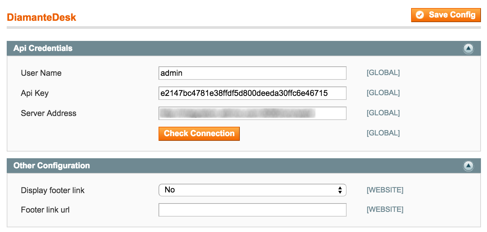

# Magento

Magento is a popular content management system that allows creating powerful e-commerce solutions. As a matter of fact, every e-commerce website should have a reliable support system that helps to quickly solve any issue, build strong customer relationships and improve overall user experience. Integrating DiamanteDesk with a website built with Magento may be the easiest solution for that.

DiamanteDesk Magento module allows both administrator and any customer to create, edit and view tickets directly on a Magento e-commerce website. 

##Installing DiamenteDesk extension for Magento

After installing DiamanteDesk integration module, it shall be configured at the Magento admin panel.

1. Log in the **Magento Admin Panel**.
2. In the navigation panel select **Systems > Magento Connect > Magento Connect Manager**.

3. Re-enter your Magento Administration credentials to verify your permissions.

Select automatic or manual installation and complete the following steps:

###### Automatic Installation

1. On the **Magento Connect Manager** screen follow the [Magento Connect](https://www.magentocommerce.com/magento-connect/) link in the **Install New Extensions** section.

The extension marketplace opens.
2. Enter **DiamanteDesk** in the **Search for Extensions** field and press Enter.

3. Select the corresponding extension module from the search results.
4. Click **Get Extension**.

###### Manual Installation

**Option 1 - Installation via FTP:**

1. Upload the addthis folder to the root Magento directory.
1. Head over to the Magento admin area and [connect DiamanteDesk and Magento](#connecting-magento).

**Option 2 - Installation via archive:**

1. Download DiamanteDesk Module archive from Github.
2. On the **Magento Connect Manager** screen, **Extensions** tab head over to the **Direct package file upload** section.

3. Select the downloaded DiamanteDesk .zip file from the local machine.
4. Click **Upload**.
5. Provide your Magento Administration Credentials in the **Manage Existing Extensions** section below.
6. After all the packages have been uploaded, move to **Settings** tab, and click **Save Settings**.

**Option 3 - Installation via Composer:**

1. Add [Firegento](http://packages.firegento.com/) repository to your ` composer.json `.
2. Add as dependency to your project using composer:

        composer require eltrino/diamantedesk
        
           
___
_Note:_ 

* Make sure that you clear the Magento caches to complete the installation of an extension. To learn more about cache management, follow this [link](http://www.magentocommerce.com/knowledge-base/entry/cache-storage-management/%09200).

* If the module has been successfully installed, a **DiamanteDesk** tab will appear next to the **System** tab in the Magento navigation pane (see the picture below).

## Connecting DiamanteDesk to Magento
After DiamantDesk module has been installed, we need to connect the actual help desk to Magento. 

In order to do that, complete the following steps:

1. Log in to **OroCRM**.
2. On the navigation pane select **System > User Management > Users**.

3. **Users** screen opens. Select the required user from the list and double click his name to open his profile.

4. Remember the **Usename** and click **Generate Key** in the **API Key** field. Copy the generated API key.
5. Get back to Magento Admin Panel.
6. Go to **System > Configuration > DiamanteDesk**. **DiamanteDesk** configuration screen opens.
7. Enter the **User Name** and **Api Key** from the **OroCRM User** screen.

8. Provide the link to the server in the **Server Address** field.
9. Click **Check Connection** to make sure that the connection with a server has been successfully made.
10. If the **Api Credentials** are correct, a new **Branch Configuration** field will be added to the DiamanteDesk configuration. Select a default branch from the **Branch** drop-down list. To learn more about branches in DiamanteDesk, see the **Branches** section in User Guide.

10. Point out whether the footer link to customer support shall be displayed. Select **Yes** or **No** option in the **Display footer link** field.
11. If the footer link shall be displayed, spcify the footer link URL in the field below.
11. Click **Save Config** on the right top corner of the screen.