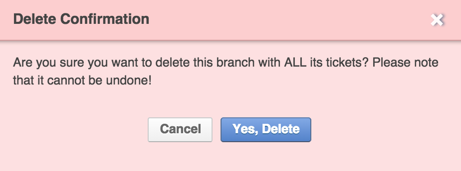

#Branches

When a customer of any service supported by the DiamanteDesk needs to report an issue or add a request, a _ticket_ is created. Each ticket has a unique identificator and is sorted according to the _branch_ where it is created or is added to a default branch.

Creating separate branches in DiamanteDesk enables our Clients to group tickets according to the requests of specific users, locations, issues, etc. This feature helps to organize tickets in a way to keep track of the tickets according to a certain category and quickly find them in a system. We remember that good customer service implies quick reaction and problem solving, so we do our best to provide our Clients with a user-friendly tool to make it happen.

_Note:_ When the ticket is automatically created from the email received at the the support email address, this ticket is created at the branch which is configured as a default one. To learn more about it, please see the [Email Processing](channels/email-processing.md) section.

To see the list of all available branches, go to _Desk > Branches_. 

## Branch Filters

All branches can be filtered according to the **Branch Name** or **Branch Key**. 

Branch key is automatically generated from the branch name when a new branch is created and it should be unique across the system. Branch key must contain only letters. Minimum length is 2 letters. If Branch name consists of more than one word, the system takes the first character of every word and converts them to upper case (for example, Green Daisy - GD, Diamante Desk - DD, etc.). If branch name consists of a single word, branch key is generated from the first 2-4 characters in the upper case (for example, Eltrino - ELTR, bbq - BBQ, etc.).

**Branch name** and **Branch Key** filters are set to **All** values by default. To filter the branches according to a certain branch name or key, click the down arrow in the corresponding filed and enter the required name or key. To refresh the results, click **Refresh**. To clear all filters, click **Reset**.

## Create a New Branch:

1. Go to _Desk > Branches_.
2. Click **Create** at the right top corner of the screen. **Create Branches** screen opens.

3. _Required field._ Enter the name of a new branch into the **Name** field.
4. Leave a **Key** field empty as it is automatically filled by the system. Branch Key is generated from the branch name and it should be unique across the system.
5. To select the **Assignee**, click **Unassigned**. A Search Panel opens. Nest, two options are available:
   * Start entering the name of the person to be assigned and the system will provide hints with matching results.
   * Click a list image to open a list of all available assignees. 
_Note:_ If you have selected a wrong assignee, click the X button next to the name of an assignee.
6. Add an image that will serve as a branch logo to the **Image** field. To do that, click **Choose file** and select a required image from your local machine.
7. You can also tag your branch. Follow the link to learn more about [branch tagging](tagging.md).
8. Provide the description of the branch in the **Description** filed.

9. Provide the domain name of the support email account (for example, mail.google.com, mail.outlook.com, etc.) in the **Support Address** field (for example, support@diamantedesk.com) and the specific user address (for example, support@diamantedesk.com) in the **Customer Domain** field.

10. Click **Save And Close** at the right top corner of the screen.

## Edit / Delete a Branch

1. Go to _Desk > Branches_.
2. Select the branch that shall be edited/deleted from the list of available banches. _Note:_ You can also filter the available branches according to the **Branch Name** and **Branch Key** to find a required branch quicker.
3. Click the branch that shall be edited / deleted. The **Branch** screen opens.

4. Select the corresponding action at the right top of the screen:

* If you click **Edit**, perform the necessary changes and click **Save** or **Save and Close**.
* If you click **Delete**, the following confirmation message is displayed:

_Note:_ If a branch is configured as the default for [Email Processing](channels/email-processing.md), the following message is displayed at the top of the **Branch** screen. In this case it cannot be deleted. 

