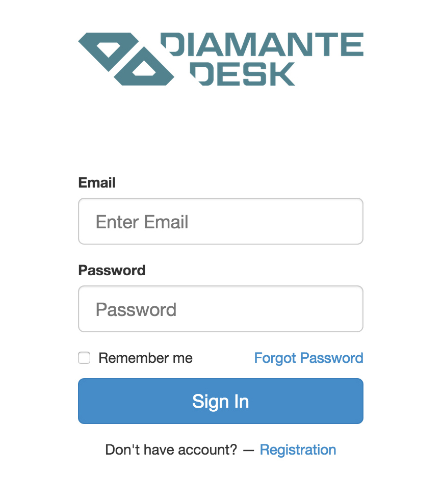
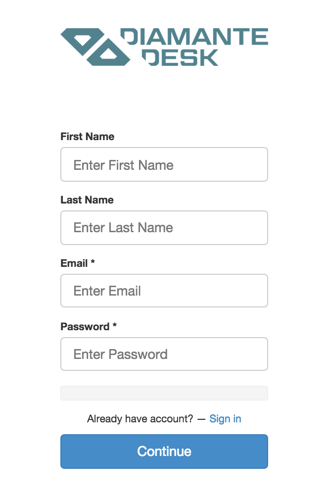
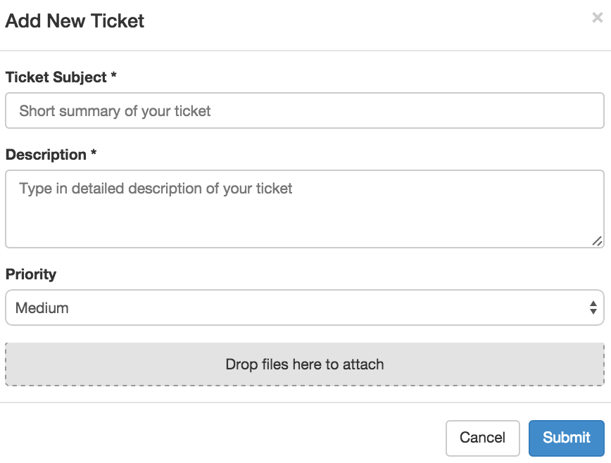

#Web Portal

When a customer attempts to leave a request or report an issue through a web portal, the system redirects this user to a DiamanteDesk request module. A user should register or provide log in details in order to create a ticket.
 

If you are new to the system, complete the following steps for registration:

1. Click **Registration** at the bottom of the log in screen. Registration screen opens. 
2. Provide your first name, last name, email and password in the corresponding fields. _Note:_ Required fields are marked with asterisk (*).
3. Click **Continue**. After all the provided credentials are successfully saved in a database, the system shows the following message:

4. Check your email box and follow a link to confirm your registration. The system redirects you to a **Sign In** screen.

If you are a registered user:

1. Provide your email address in the **Email** field.
2. Provide a password in the **Password** field.
3. Click **Sign In**.

_Note:_ If you forgot your password, complete the following steps:

1. Click **Forgot Password** under the **Email** and **Password** fields.
2. Provide your email address in the **Email** field.
3. Click **Reset Password**.
The following message appears:

4. Check your email box and follow a link to reset your password.
5. Enter a new password.
6. Click **Create New Password**.
7. If passport was successfully changed, the system shows the following message:

##User screen

After a user logs into the system, he gets to a **User Screen**. A newly registered user has an **Add a New Ticket** option (see below). A previously registered user, who has created requests in past, can look through the table with all the previous requests showing their:

* **Key**. Key is an identifier of the branch, where the request has been created. This identifier is automatically generated by taking the first character(s) of every word in brunch name and converting them to upper case (for example, Green Daisy - GD, Retailing - RTL, etc.)
* **Date** field displays the date when the request has been created.
* **Subject** is a short summary of an issue occurred.
* **Priority** field displays the selected priority of the created ticket (Low, Medium or High).
* **Status** field indicates the stage of solution (New, Open, Pending, In Progress, Closed, On Hold).

##Add New Ticket

To create a new request, a user shall add a ticket by completing the following steps:

1. Click **Add New Ticket** at the right corner of the screen. **Add New Ticket** screen opens.

2. Provide a short summary of a ticket in the **Subject** field.
3. Type in the detailed description of a ticket in the **Description** field.
4. Select the priority level of your ticket from the **Priority** drop-down list. The available options are:

   * **Low** for a non-urgent request or issue that does not have critical effect on a production process.
   * **Medium** for an important non-urgent request.
   * **High** for a critical issue or an urgent request.

5. In case there is a file that shall be attached to the ticket (image or document), click **Drop files here to attach** and select the required file from your local machine.
6. Once you provided all the necessary information, click **Submit**.

## Web Portal Configuration

Tickets can be also created without the required registration. To configure this option, go to _System > Configuration_. On the **System Configuaration** pane select the **DiamanteDesk** menu and **Channels** tab.

The **Channels** screen opens.

Configure whether a user shall complete the registration process before creating a new ticket in the **Web** section.

By default, registration is always required. To change this configuration, make sure that the **Use Default** check box is clear and set the **Registration required** field to **Yes** or **No** option.

To save the changes made, click **Save Settings** on the right top corner of the screen.