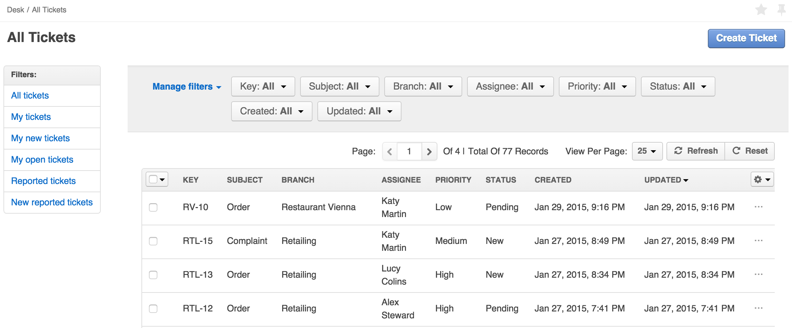
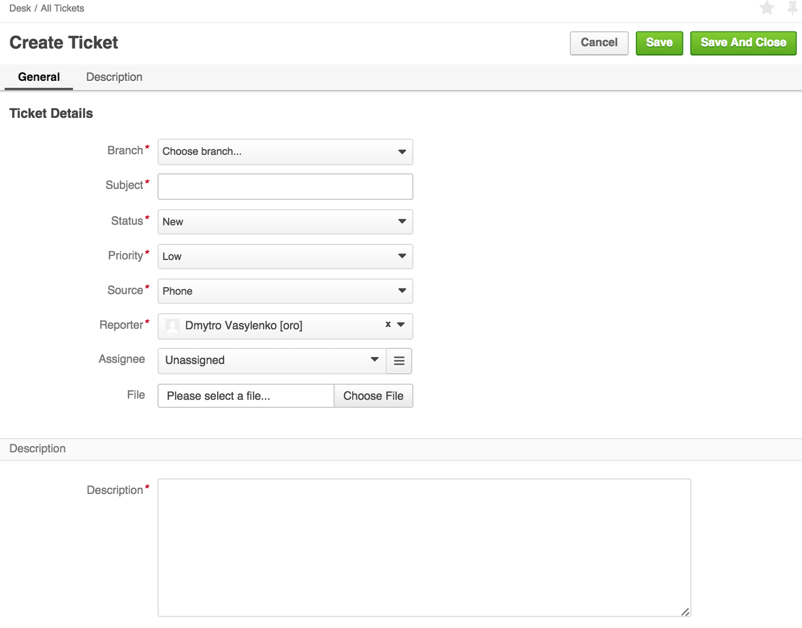

#Tickets

DiamanteDesk is a comprehensive help desk, built using the OpenSource software. This tool is a great way to improve customer experience by easily receiving, reassigning and taking care of any Client requests presented in **tickets**.

Tickets can be viewed and added at:

* _Desk > Branches_ (see [**Branches**](branches.md) section)
* _Desk > All Tickets_

##Ticket Filters

All the tickets on this screen can be filtered according to the number of various parameters:

1) A user can view tickets according to the categories they belong to.

  * **All tickets** category allows viewing all tickets created in the system.
  * **My tickets** category filters all the tickets created by the account owner.
  * **My new tickets** category filters all the tickets recently created by the account owner.
  * **My open tickets** category allows viewing all open tickets created by the account owner.
  * **Reported tickets**
  * **New reported tickets**

2) Tickets in each category can be also filtered by the following parameters:

_Note:_ Each of the parameters is set to **All** values by default. To change this value, click the down arrow next to to the specific filter that shall be changed.

* **Key.** Enter the required branch key and click **Update**. Ticket Key consists of the branch key and ticket sequence number and has next format {_branchKey_}-{_ticketSequenceNumber_}. 
* **Subject.** Provide the summary of a ticket in this field.
* **Branch.** Select the required branch from the drop-down list and click **Update**.
* **Assignee**. To filter the tickets assigned to a specific person, enter the name of that person into the **Assignee** field.
_Note:_ You can't change this value when looking through the tickets in **My tickets** and **My new tickets** categories, the assignee in these categories is always an owner of the account.
* **Priority.** Set the filter to **Low**, **Medium** or **High** priority.
* **Status.** Select one or several statuses for ticket filtering. The available statuses are: **New**, **Open**, **Pending**, **In progress**, **Closed** and **On Hold**.
  
* **Created** Select the date range when the tickets could could be updated either from a drop-down calendar or by selecting one of the available variables (Now, today, Start of the week, Start of the month, Start of the quarter, Start of the year).
* **Updated.** Select the date range when the tickets could could be updated either from a drop-down calendar or by selecting one of the available variables (Now, today, Start of the week, Start of the month, Start of the quarter, Start of the year).

## Create a New Ticket

To create a new ticket, complete the following steps:

1. Click **Create Ticket** at the top right corner of the screen. **Create Ticket** screen opens.

2. Select the branch from the drop-down list.
3. Specify the short summary of a ticket in the **Subject** field.
4. Select the status of a ticket.
5. Select the priority of a ticket.
6. Select the **Source** of the ticket. Every service user has 3 available options to contact the Help Desk team:
   * by creating a request through a **Web** form;
   * as an **Email** notification;
   * via a **Phone** call.
7. Select the **Reporter** from the drop-down list. Reporter is an administrator who can create a ticket for any customer.
8. To select the **Assignee**, click **Unassigned**. A Search Panel opens. Start entering the name of the person to be assigned and the system will provide hints with the matching results or click a list image to open a list of all available assignees. 
9. In case there is a file that shall be attached to the ticket (image or document), click **Choose file** in the **File** filed and select the required file from your local machine.
11. Provide the description of a ticket in the **Description** field.
12. Click **Save** or **Save and Close** at the right top corner of the screen for a corresponding action.

## Notifications

**Email Notifications** is a DiamantDesk feature that sends automatic messages to the ticket creator when the [status](#status) of a ticket changes. This way a customer is notified whether his request is being processed.

This functionality can be configured according to the customers' needs at _System > Configuration_. On the left side side of the screen on the **System configuration** pane select **Notifications** tab in the **DiamanteDesk** menu.

**Notifications** tab opens.

To use the default settings, select the **Use Default** check box in the **Email Notifications** field. 

To edit the configurations, clear the the **Use Default** check box and set the **Enable Email Notifications** field to **Yes** or **No** option.

To save the changes made, click **Save Settings** on the left top corner of the screen.