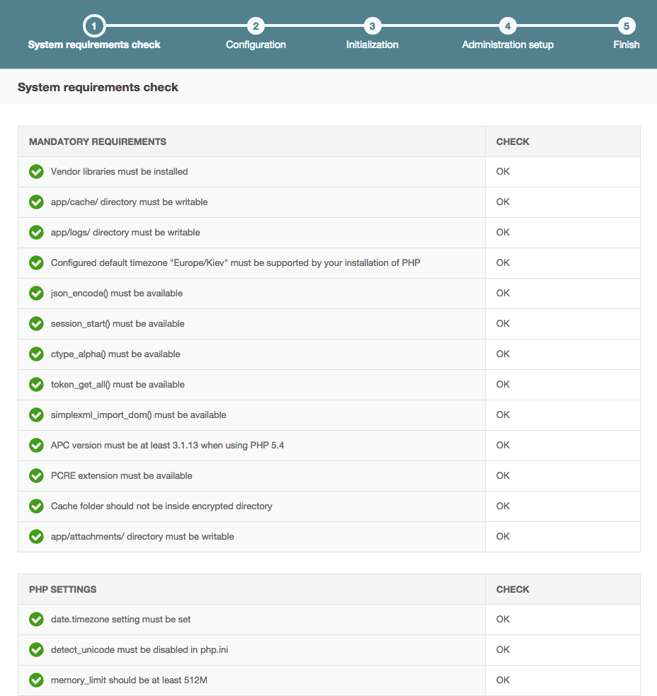
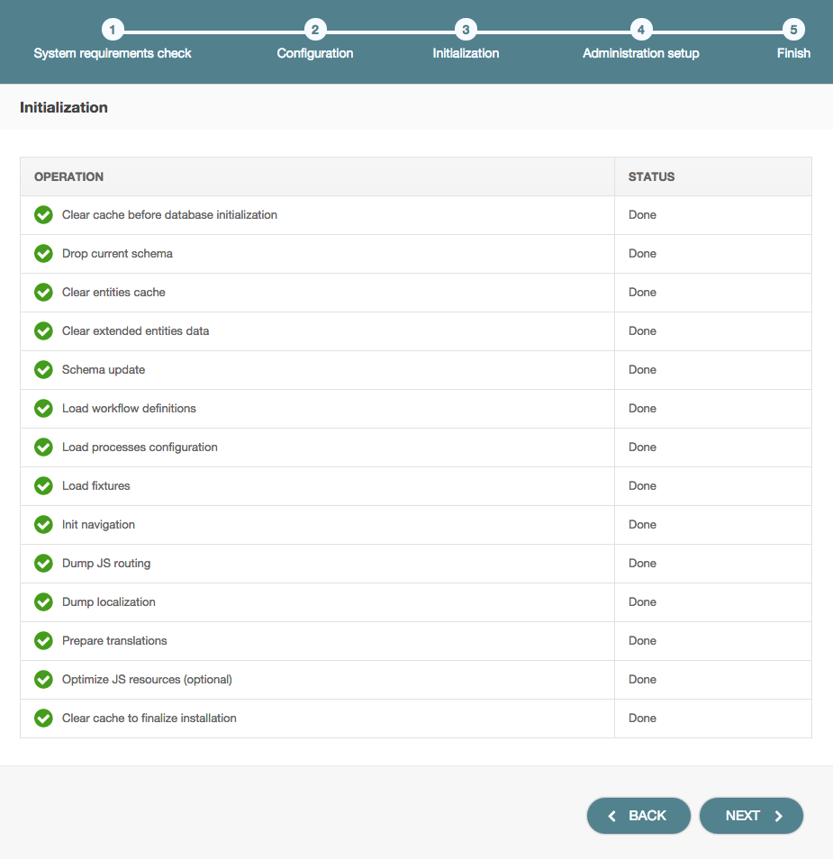

DiamanteDesk may serve as an independent end-user application or as an extension for OroCRM. In the nearest future it will also be available for other CRMs. 

This section provides detailed instructions on various options of DiamanteDesk application installation.

##Requirements

DiamanteDesk application was built using **Symfony** 2.3 framework and **Oro Platform**; therefore, all the prerequisites listed as [Symfony](http://symfony.com/doc/2.3/reference/requirements.html) and [Oro](http://www.orocrm.com/documentation/index/current/system-requirements) system requirements also refer to DiamanteDesk.

DiamanteDesk Requirements:

* **app/attachments** folder needs to be writable;
* DiamanteDesk uses **Composer** to manage package dependencies. To learn more about the composer and download it from the official website, follow this [link](https://getcomposer.org/);
* MySQL database server with an empty database.

Optionally, providing that your portal shall be customized, your system shall comply with additional requirements:

* NPM package manager needs to be installed;
* Grunt needs to be installed (globally);
* Bower needs to be installed (globally).

You can also check whether your system meets all the requirements from the command line. In order to do that, you should start with getting the [application code](#get-code) from Github and install required [libraries](#libraries). Next, run the following command:


php app/check.php

    
###Web Server configuration

DiamanteDesk application was developed on the basis of the Symfony standard application so you can learn more about web server configuration recommendations [here](http://symfony.com/doc/2.3/cookbook/configuration/web_server_configuration.html).

_**Note:** DiamanteDesk makes heavy use of HTTP methods in RESTful calls. The server can be configured to block some of them (for example, PUT, DELETE, etc.). However, this limitation should be removed, otherwise, a certain part of application will not function properly._

## Installation of a Standalone Application

Step 1: Get the Application | 
------------- | -------------

You can get the latest stable or latest developed version of application using one of the following options. Option 1 is deemed preferable to Option 2.

**Option 1: Getting the Latest Stable Version**

Two options to get the latest stable version of the application are available. Select the one you find the most suitable:

* Downlaod the latest stable version using **Git**:


git clone -b 1.0 https://github.com/eltrino/diamantedesk-application

     
**OR**

* Download the application with the **composer package manager**:


php composer.par create-project diamante/desk-application


**Option 2: Getting the Latest Development Version**

Select one of the following options to get the latest **development** version:

* Clone the [GitHub repository](https://github.com/eltrino/diamantedesk-application#usage) to get the source code:


git clone https://github.com/eltrino/diamantedesk-application


**OR**

* Download using the composer:


php composer.par create-project diamante/desk-application:dev-master

    
Step 2:  Install the Required Libraries | 
------------- | -------------

Install the dependencies with the composer:


php composer.par install


Step 3: Create a Database | 
------------- | -------------

To install DiamanteDesk you also need to setup MySQL database server with an empty database that will be used later on. Use the following command:


php app/console doctrine:database:create


Step 4: Install the Application| 
------------- | -------------

The application can be installed either using a console or via a web wizard. Select the most suitable version:

**Option 1: Installation Using a Console**

To run the installation of DiamanteDesk in a console mode, use the following command:


php app/console diamante:install

     
Additional commands may be required. The system will guide you through the process with questions and command options.

If the system configuration does not meet the requirements, the _install_ command provides corresponding messages. In case there are any issues, fix them and run the command again.

**Option 2: Installation Using Web Wizard**

To install the application through a web wizard, follow the link below:


http://localhost/install.php

    
When DiamanteDesk installation screen opens, click **Begin Installation**. 

Firstly, installation wizard automatically checks system requirements.

In case there are any issues, fix them and refresh the page. After all system configurations meet installation requirements, click **Next**.

The next step of installation process is configuring the application. Provide the data for **MySQL database connection**, **Mailer settings**, **System settings** and **Websocket connection** if the fields are not filled out automatically.
> _Note:_ If the application is installed for the first time, leave the **Drop Full Database** check box clear, if you reinstall the application, select this check box.

Click **Next** and the installer will initialize your database. The list of tasks and the progress on their performance will be shown.

After you move on to the next step, you should provide such administrative information as company name, link to the application and administrative credentials.

Click **Install** to finish the setup process. 
 
After the DiamanteDesk application is successfully installed the following message is displayed:

##Bundles Installation

Development in progress.

##Oro Marketplace

Development in progress.

##Docker Prebuilt Image 

To learn more on how to use Docker image, please follow this [link](https://github.com/eltrino/diamantedesk-docker).