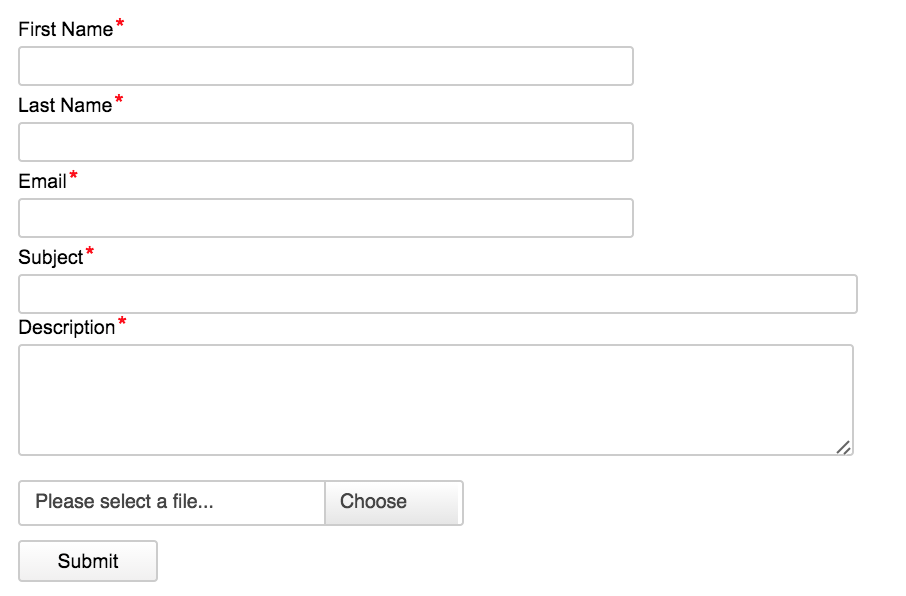
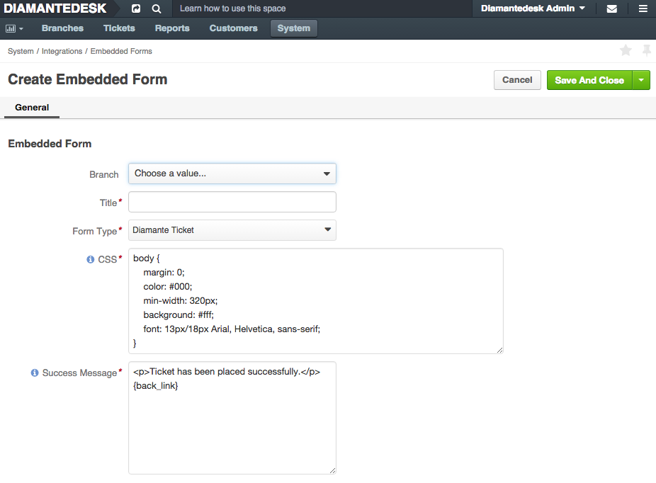
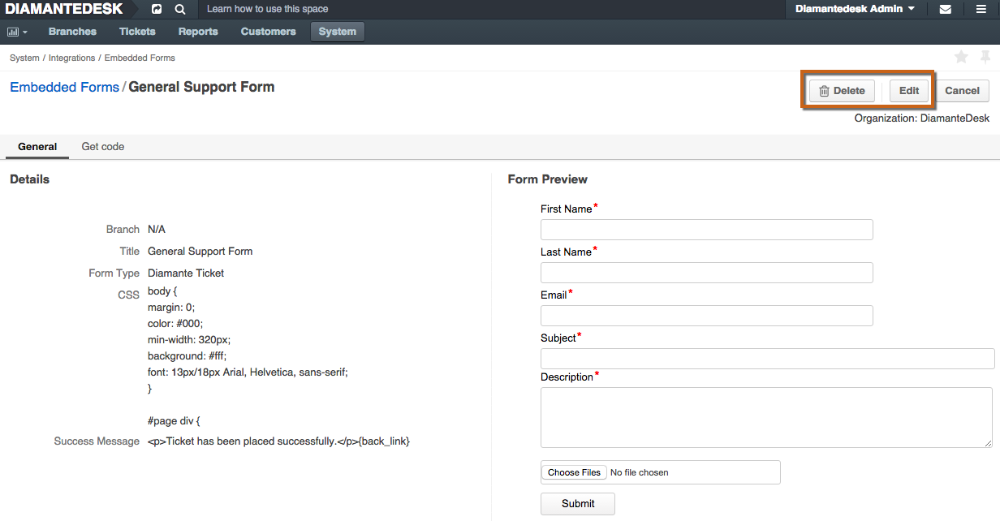
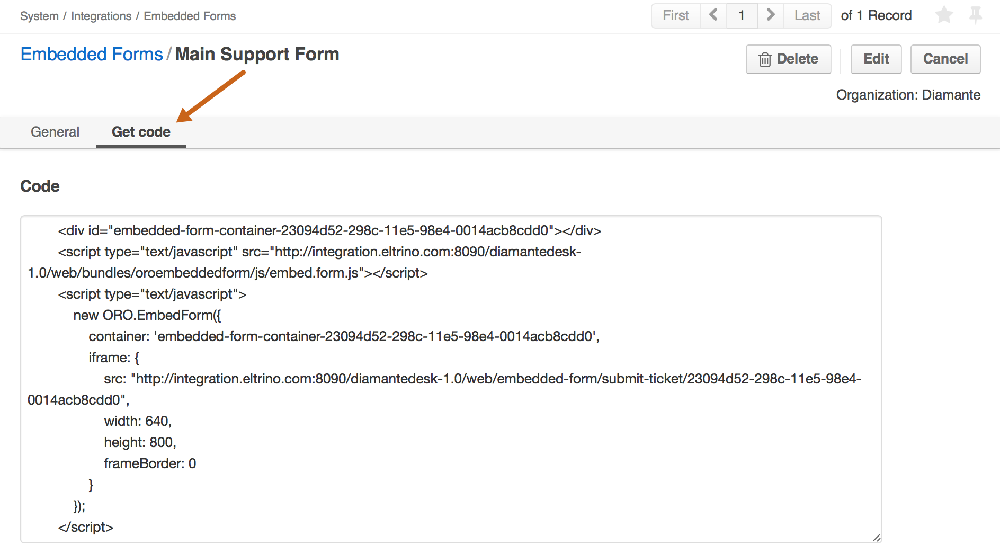

#Embedded Form

DiamanteDesk is a help desk designed to improve user experience for each of your present and future customers. 

In complex systems something may always go wrong and any user should always have various options to contact your support team and let them know what should be fixed or changed. DiamanteDesk system offers several options to do that: by sending an [email](email-processing.md), via a phone call or through a [web portal](portal.md). Some of our Clients also prefer to embed a support form into their website.

DiamanteDesk provides functionality for creating embedded forms on the third-party websites. Take a look at the picture below to see the initial form. It can be modified according to the design of your website.

This form includes the fields for acquisition of user **First Name** and **Last Name**, **Email**  that is going to be used to inform a user on the status of a ticket creation and processing, the **Subject** field for a short precise description of a request or an issue, the **Description** field to specify a reason to contact the support team in details and attachment field allowing to add screenshots in case there are any UI issues.

After a user clicks the **Submit** button, the message from the embedded form is automatically converted into a ticket in a specific branch.

##Create Embedded Form

To create a new embedded form, head over to _System > Integrations > Embedded Forms_  and click **Create Embedded Form** at the right top corner of the screen.

**Create Embedded Form** screen opens. Fill out the fields to add a new embedded form to your website. 

>_Note:_ Required fields are marked with asterisk (*). 

Field  | Description
:------------- | :-------------
Branch  | Select the branch where all the tickets converted from the embedded form shall be created. This may be a separate branch created specifically for such tickets or a certain website, etc. To learn more about **Branches** take a look at the corresponding section in DiamanteDesk User Guide.
Title | Specify the title that is going to be used to refer to current embedded form on the Client website or system.
Form Type | Currently only one form type is available in the DiamanteDesk application, hence select the **Diamante Ticket** option from the drop-down list.
CSS | This field contains default CSS, which corresponds to the initial form design. It can be edited according to the design of your website by changing border width, color, fonts settings, etc.
Success Message | This message is to be displayed on the website after the successful form submission. It has the following default message: _Ticket has been placed successfully._

After all the required fields are filled with all the necessary information, click **Save and Close** or **Save** at the right top corner of the screen.

After the form is saved, it appears in the Embedded Forms grid.

##Edit / Delete Embedded Form

1. Go to  _System > Integrations > Embedded Forms_.
2. Select the form that shall be edited/deleted from the list of available embedded forms. 
3. Click the form that shall be edited / deleted. The **Embedded Form** screen opens.

4. Select the corresponding action at the right top of the screen:

* If you click **Edit**, perform the necessary changes and click **Save** or **Save and Close**.
* If you click **Delete**, the following confirmation message is displayed:

##Adding Embedded Form to the Website

1. Go to  _System > Integrations > Embedded Forms_.
2. Open the form that shall be added to the website.
3. Select the **Get Code** tab to view the source code.

4. Copy the code an add it to your website.
