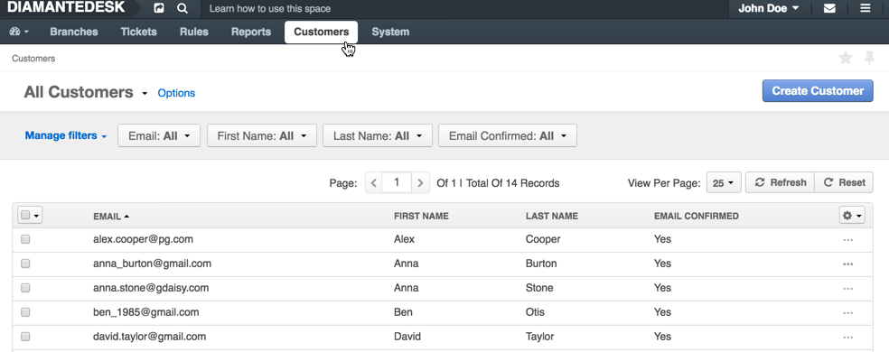
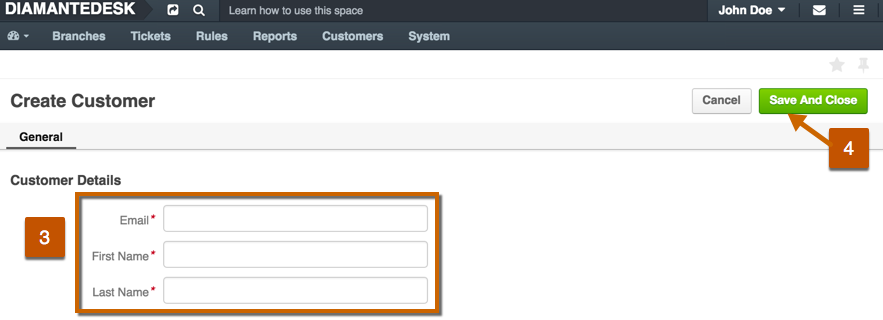
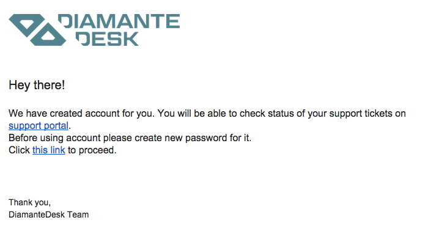
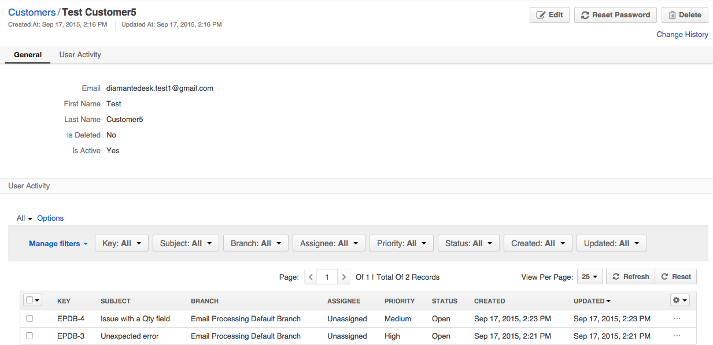
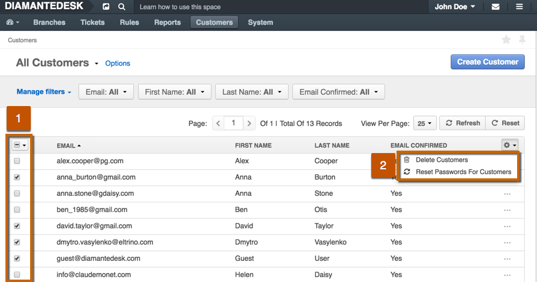
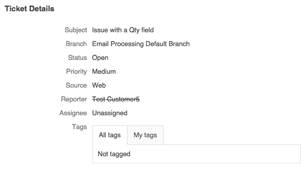
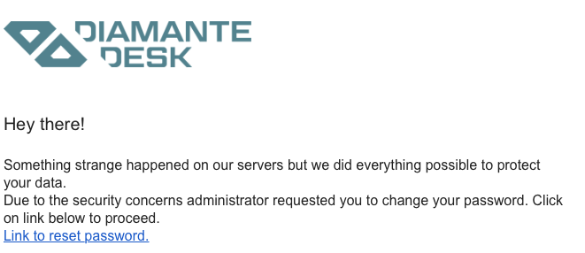

Every customer who creates a ticket at the DiamanteDesk [portal](channels/portal.html) or sends an email to the [support address](channels/email-processing.html) is automatically added to the help desk customer database. This helps keeping track of all the tickets created by a specific user and monitor general customer activity.

To see the list of existing DiamanteDesk customers, open the **Customers** top menu.

## Create a New Customer

To create a new customer, navigate to the **Customers** top menu. The **Customers** screen opens. Click **Create User** at the top right corner of the screen. **Create Customer** screen opens.

To create a new customer user, provide the same information that would be required to register at the portal or that would have been automatically populated from the email during the email processing: user **Email**, **First Name** and **Last Name**.
After all the necessary information has been provided, click **Save** or **Save and Close** to add new user to the system.

After the user account has been created through the admin panel, via email processing functionality or at the portal, email owner receives the following email:

## Customer Account

The customer (user) account screen contains general information about the customer, such as name and email and his activity in DiamanteDesk.

To open the customer account in the system, navigate to the top **Customers** menu and click it once to open the list of existing customers. Select the row of a specific user and click it once to open a customer account screen.

Field | Description
------------- | -------------
Email, First Name, Last name | These fields display  general information about the account owner. This information is obtained either from an email during email processing, from the provided credentials when the user registers in a portal or if admin user creates customer account in a system.
Is Active | When this field is marked as active, he can successfully log into DiamanteDesk and may create new tickets or resolve any existing ones. If the user is inactive, he should confirm or change his password to be able to log into the system.

The **User Activity** section of the customer account screen displays the general information about all the tickets created by the user in a system.

## Mass Actions

Mass action allows to perform mass operations on the selected rows of the grid. DiamanteDesk offers the following mass actions that can be applied to the customer profiles selected from the grid:

* **Delete Selected Users** Use this action to delete several customer profiles at a time. Keep in mind that in DiamanteDesk, if the customer profile is deleted, the user information is not entirely removed from the system. It is usually marked as deleted and the profile of a deleted customer is removed from the list of existing customers, although the system displays strikethrough customer first and last name at the tickets where he was assigned as a reporter or if he authored any comments as shown on the example below.

* **Force Reset Passwords For Selected Users** This option allows administrators to force certain users to change their passwords due to security measures or any other specific reasons. All the selected users receive emails notifying them that they should reset their passwords, providing a link to the page where the password can be changed.

