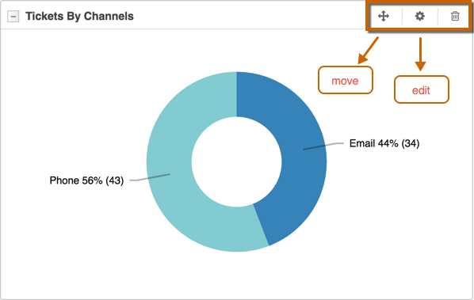

Dashboards in DiamanteDesk is a progress control panel providing a quick access to the most valuable and constantly changing data in the supports system. The information that shall be easily available is added to the dashboard via widgets. If needed, several dashboards may be created for different purposes to provide better organization and data clarity.

## Add Dashboard

To add a new dashboard:

1. Click the dashboard top menu at the left corner of the screen.

2. Select **Manage Dashboards** from the drop-down menu. The **Manage Dashboards** screen opens.
3. Click **Create Dashboard** at the top right corner of the screen.

Field | Description
------------- | -------------
Label  | Provide the name for this dashboard. If there are several dashboards in the system, make sure that dashboard name clearly describes its purpose.
Clone from  | This option allows copying one of the existing dashboards. For example, when several departments or administrators need dashboards where most of widgets are similar but some may be different, there is no need to create each of them from scratch. Click the down arrow and select the existing dashboard that shall be cloned. To create a new dashboard from scratch select **Blank Dashboard**. 
Owner | By default, this field is populated with the account of the administrator currently logged in to the system. Click the list button to make another administrator a dashboard owner. An owner can manage the dashboard according to the needs of administrator. 

Click **Save** or **Save and Close** at the top right corner of the screen for the corresponding action. After the dashboard is saved it becomes available at the dashboard top menu. If it has been cloned from the previously existing dashboard, it contains the same widgets, if it was created from scratch, it is empty as at the example below.  

## Dashboard Widgets

Widgets in DiamanteDesk provide quick access to the required information. 

To add a new widget:

1. Open the dashboard where a new widget shall be addded.
2. Click **+ Add Widget** at the top right corner of the **Support Dashboard** screen or **add a new widget** at the corresponding drag and drop section of the dashboard. The **Dashboard Widgets** screen opens.

3. The **Dashboard Widgets** screen opens.

4. Select the required widget from the list and click **Add** to add it to the dashboard. To add more widgets, repeat the procedure.

You can move, edit and delete each of the added widgets by using the corresponding icons at the top of the widget section.

_Note: All the reports available in the DiamanteDesk can be added to the dashboard as widgets. To learn more about reports in DiamanteDesk, refer to [this](reports.html) section._