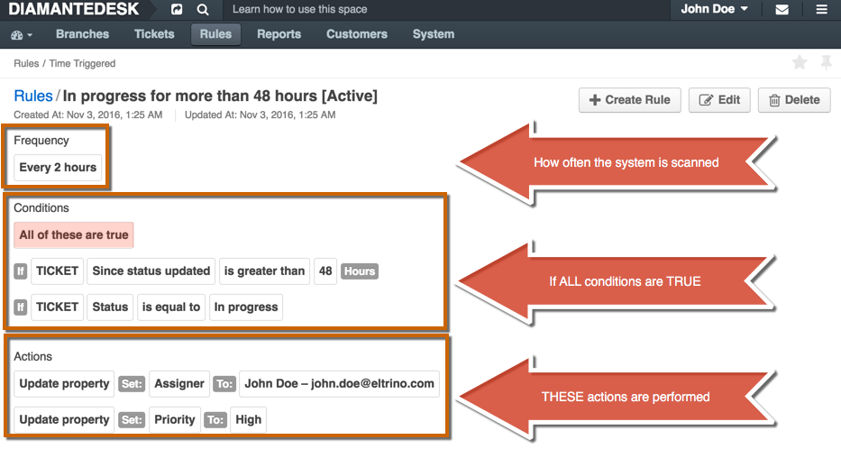
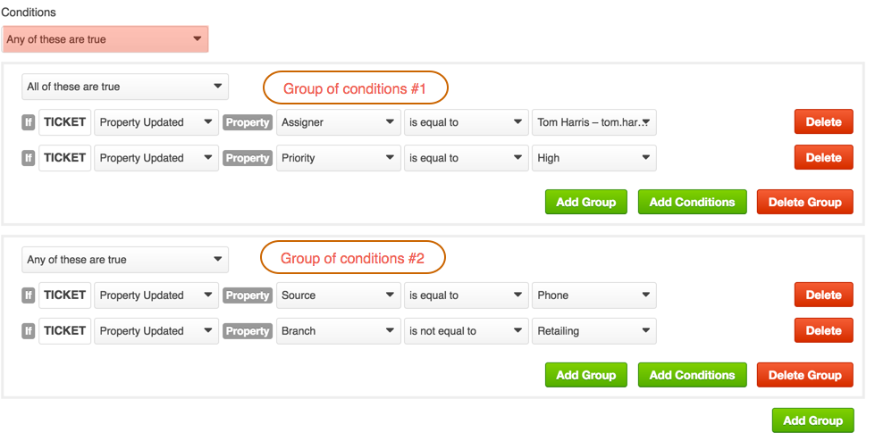
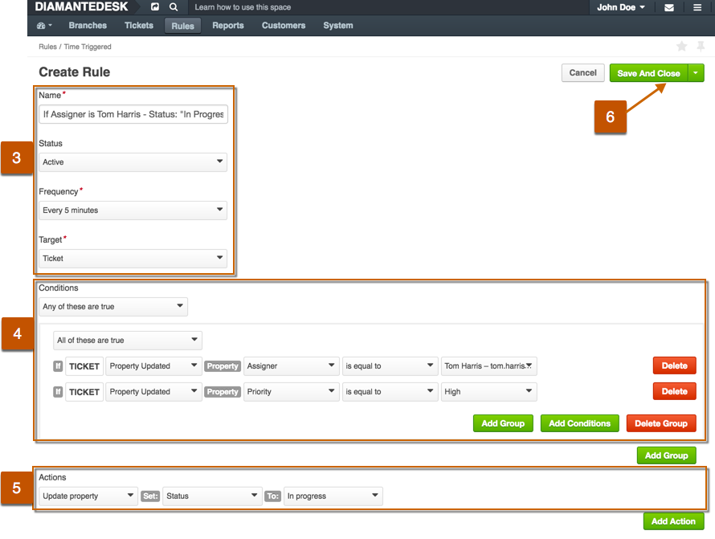
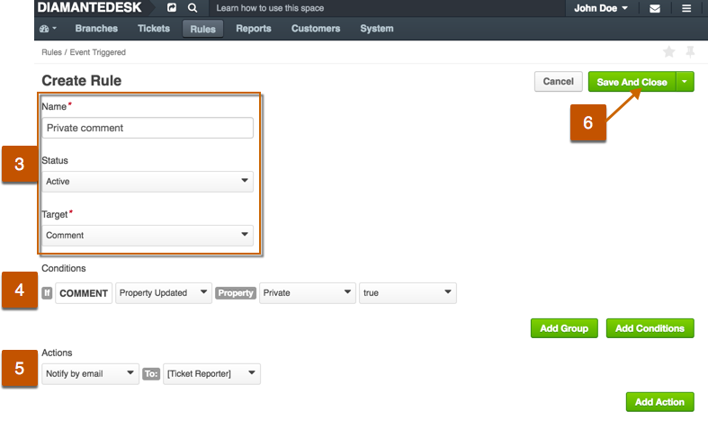

**Rules** determine automated system behaviour governed either by other events or based upon the predefined frequency. 

_Example:_ When a new ticket is created and the **Subject** field contains "ASAP" acronym or other keywords or phrases implying urgency, the priority of a ticket should be automatically set to **High** to make sure it will be taken care at the earliest opportunity.

This helpful feature offers the ability to configure system behavior quickly and easily, without involving developers.

Rules can be created / configured from the respective top menu item, shown in the picture below. 

Working principles of Rules are related to:

* **time triggered**, 
* **event triggered** system behavior.

Both types of these rules should have predefined **Conditions** and **Dependent Actions**, but the major difference between them is that in case of "event triggered rules", the resulting action is performed right after one or several conditions are met, and with the "time triggered rules" conditions might be met,  but the defined action is only going to be performed after the system "scans" after specified period of time.

## Rules Logic (Examples)

Each rule consists of **Conditions** and **Dependent Actions**. You are not limited to setting a rule with a single condition or single action. Instead, you are free to define complex conditions or group(s) of conditions and as many dependent actions as required.

Let's review the following **example**:

If there are tickets with status "in progress" for more than 48 hours, we want them to get a higher priority and be assigned to a specific Administrator. In this case, we can create a Time triggered rule and define how often do we want to scan the system to find such tickets. This is how such rule is going to look:

###Nested Conditions or Groups of Conditions

DiamanteDesk is capable of performing actions triggered by multiple conditions or even complex groups of conditions. Let's take a look at the example below:

In this case we have 2 groups of conditions and if **ANY** of them are true, the action is going to be performed:

Group 1        | OR       | Group 2   |
--------------------|------------------|-----------------------|
         Ticket is updated **AND** its property is "High"   |    | Ticket was created from the "Phone" request **AND** has been added to the "Purchase Orders" branch  |
         
By specifying multiple conditions or groups of conditions, system behaviour may become remarkably automated and save time of your consultants.

## Creating a Time Triggered Rule

_Time triggered rules can be applied to tickets only._ 

To create a new rule, triggered within ceratain time intervals, follow these steps:

1) Go to _Rules > Time Triggered_. A list of **All Time Triggered Rules** previously created in the system opens.

2) At the top right corner click **Create Time Triggered Rule**. 
The **Create Rule** page opens.

3) Provide the following general information:

Field| Description |
------------- | -------------
Name          | Define a meaningful name of the condition. We recommend mentioning conditions and actions in the name to avoid confusion.
Status        | Define whether this rule should come into full force right after being saved. This setting is usually set to "Active" by default, but if you want to enable it later, choose "Inactive" from the drop-down list.
Frequency     | Choose how often the system should be checked to find the tickets matching the specified conditions.
Target        | _Ticket only._

4) Define the **Conditions**.  The condition part is a logical test that, if satisfied or evaluates to true, causes the action to be carried out. Here are the things you want to keep in mind when adding conditions:

* You may add several conditions or groups of conditions by clicking **Add Conditions** or **Add Group**, respectively.
* If more than one condition or more than one group of condition is added, you should define whether **All of these are true** or **Any of these are true**

5) Define the **Actions** which should follow if conditions are met.

6) At the top right corner of the screen click **Save and Close**.

## Creating an Event Triggered Rule

_Event triggered rules can be applied to **tickets** and **comments**._

To define a dependent action, triggered by some other event in the system:

1) Go to _Rules > Event Triggered_. A list of **All Time Event Rules** previously created in the system opens.

2) At the top right corner click **Create Event Triggered Rule**. 
The **Create Rule** page opens.

3) Provide the following **General Information**:

Field| Description |
------------- | -------------
Name          | Define a meaningful name of the condition. We recommend mentioning conditions and actions in the name to avoid confusion.
Status        | Define whether this rule should come into full force right after being saved. This setting is usually set to "Active" by default, but if you want to enable it later, choose "Inactive" from the drop-down list.
Target        | Ticket or comment. 

4) Define the **Conditions**. The condition part is a logical test that, if satisfied or evaluates to true, causes the action to be carried out. Here are the things you want to keep in mind when adding conditions:

* You may add several conditions or groups of conditions by clicking **Add Conditions** or **Add Group**, respectively.

* If more than one condition or more than one group of condition is added, you should define whether **All of these are true** or **Any of these are true**.

5) Define the **Actions** which should follow if conditions are met.

6) At the top right corner of the screen click **Save and Close**.
