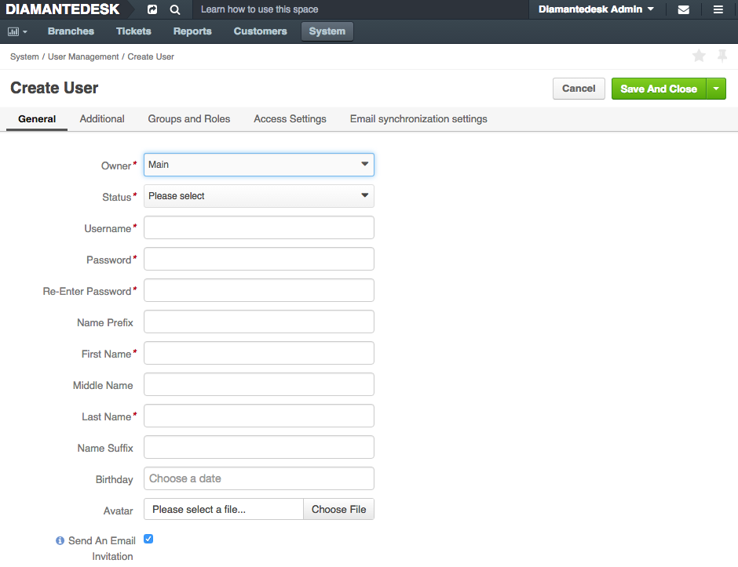
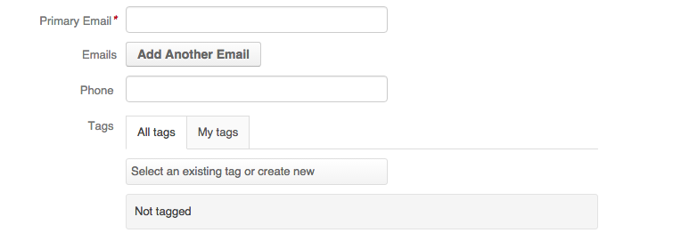
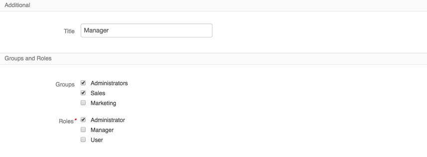
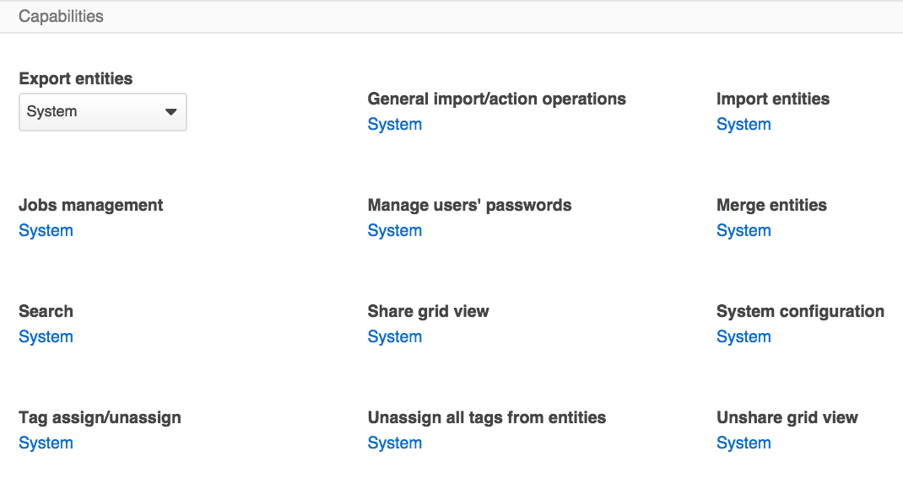
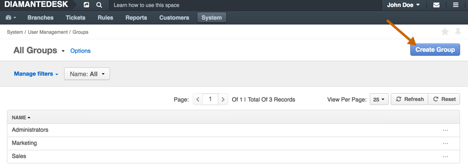

**User Management** serves to create new admin users in DiamanteDesk or to review/edit information about the existing ones. Each user has a certain role, access settings and belongs to one of the existing groups, defining his default permissions in the system.

To review the list of all users in the system head over to _System > User Management > Users_:

## Create a New User

To create a new user profile in the DiamanteDesk system, head over to _System > User Management > Users_ and click the **Create User** button at the right top corner of the screen or go directly to _System > User Management > Create User_.

After you get to the **Create User** screen, provide the general user information.

Field                       | Description
-------------               | -------------
**Owner**                   | Define a business unit a User belong to.
**Status**                  | Account can be either **Active** or **Inactive**. 
**Username**, **Password** | Create a **Username** and **Password** that will be used by a newly created user to log in. **Re-Enter** the password in the following filed to make sure you typed it in correctly.
**Name Prefix**             | _Optional._ Mr, Ms, etc.
**Name Suffix**             | _Optional._ Jr., Sr., PMP, etc.
**Birthday**                | Select the **Birthday** from the drop-down calendar in the corresponding field
**Avatar**                  | Add a profile picture from your local machine.
**Send an Email Invitation**| Choose whether you want a user to receive an welcoming email after you save his/her profile.

Field                       | Description
-------------               | -------------
**Primary Email**           | Enter the user's email here. This email is going to be used for email notifications and password recovery. Click **Add Another Email** in the **Emails** field to add additional email in case the primary one is not available for any reason.
**Tags**                    | Tagging functionality is identical throughout the system. To learn more about tagging, follow this [link](tagging.html)

Field                       | Description
-------------               | -------------
**Title**                   | Provide the Position of a newly created user in the section for **Additional** information.  
[**Groups**](#user_groups) and [**Roles**](#user_roles)| Select the **Groups** and **Roles** the newly created user will belong to. This selection will define user access rights and permissions. You can create/edit/delete Roles and Groups at _System > User Management > Roles / Groups_ respectively. More than one group or role may be selected for one user.

### Edit User Account

To edit user account in the DiamanteDesk:

1. Go to the list of all users in the system at _System > User Management > Users_.
2. Select the user account that shall be changed and open it.
3. At the top right corner of the screen click **Edit**. Perform the required changes.

4. Click **Save and Close** or **Save** at the right top corner of the screen.

## My Account

To review your account information, click _your username > My User_ at the right top corner of the screen. 

My account details screen opens.

To edit your account information, click **Edit** at the right top corner of the screen, perform the necessary changes and click **Save**.

##  User Roles

When a new user is created within DiamanteDesk, he is assigned with a certain _role_ that determines a set of his permissions and access rights, defining actions a user is allowed to perform. Each user may have one or several roles.

To look through the list of available user roles head over to _System > User Management > Roles_. You can also create new roles from this screen. Open some role to see permissions assigned to it.

### Permissions

Each role defines the list of actions that may be performed to a certain entity.
 

Action | Description
------------- | :-------------
View  | Allows viewing the content of the entity records, grid items.
Create | Allows creating new records for defined entities.
Edit | Allows editing entity records, grid items.
Delete | Allows deleting entity records, grid items.
Assign | Allows assigning the entity records to a different owner.

Permissions may be defined by selecting one of the following options for each entity and the actions that may be performed there.

Option | Description
------------- | :-------------
None | None of the users with this role are able to perform the action.
User | Allows the owner-user to perform the corresponding action.
Business Unit | Allows all the users within a business unit to perform the action.
Division | Allows all the users within a division of a business unit to perform the action..
System | Allows all the users with the same role to perform the corresponding action.

###Create a New User Role

1. Navigate to _System > User Management > Roles_.
2. Click **Create Role** at the top right corner of the screen. The **Create Role** screen opens. 
3. Provide the role name, preferably defining the group of users, who will be granted certain permissions (for example, Administrators, Users, etc.) in the **General** tab.

4. Grant certain permissions by selecting the corresponding options for each action in all entities.
5. The **Capabilities** tab consists of all sorts of functions that may be available for the users. Define what functionalities are available for a user with this role. Users with different roles will see system functionality differently and can perform different actions, accordingly.

6. Choose the existing users that will be granted this role by selecting the check boxes in the corresponding rows.
7. Click **Save** or **Save and Close** to proceed.

##  User Groups

A user group is a collection of user accounts having the same core responsibilities (for example, Administrators, Marketing, Sales). Each user may belong to one or several groups.

To look through the list of available User Groups head over to _System > User Management > Groups_.

### Create a New User Group

1. Go to _System > User Management > Groups_.
2. Click **Create Group** at the right top corner of the screen. The **Create Group** screen opens.

3. The **Owner** field is automatically filled with **Main** value by default.
4. Provide the general name of the group in the **Name** field.
5. Choose the members belonging to this group by selecting the check boxes in the corresponding rows.
6. Click **Save** or **Save and Close** to proceed.